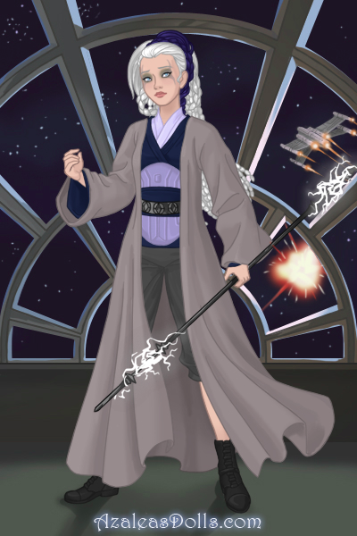
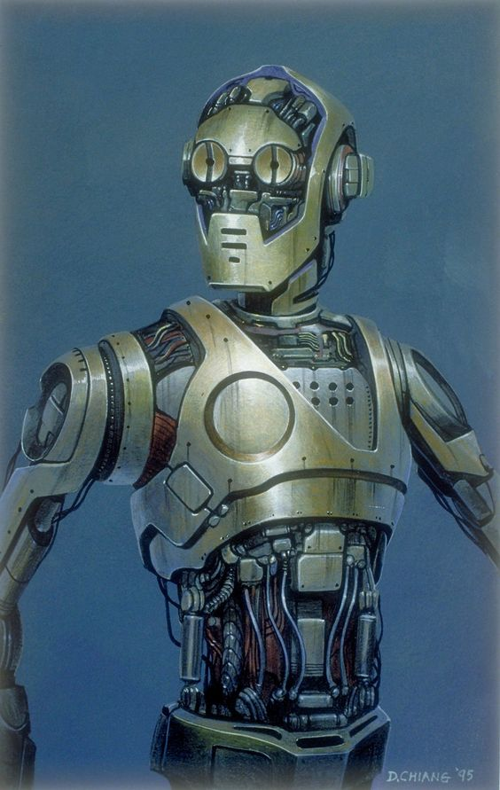
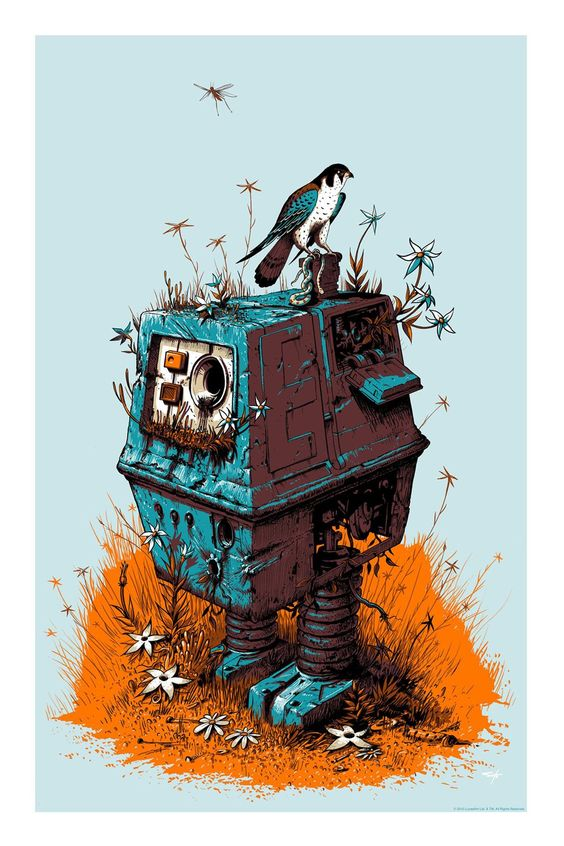
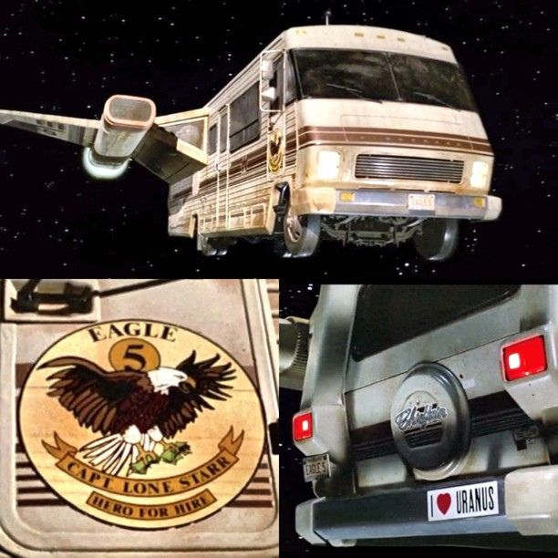
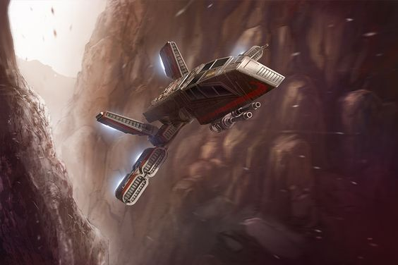
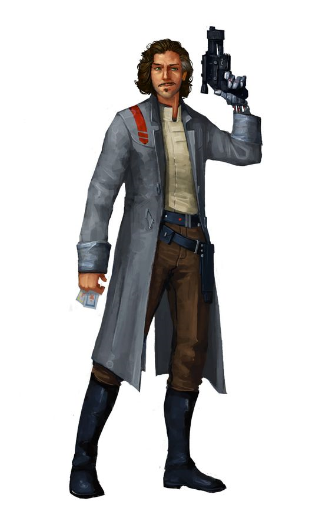

The Quest for Booty
=================

Formerly known as *Nerdy Folks Play Star Wars RPG*

Table of Contents
=================

   * [The Quest for Booty](#the-quest-for-booty)
   * [Table of Contents](#table-of-contents)
   * [Character info](#character-info)
      * [Kasgan Gone](#kasgan-gone)
      * [Jarlo](#jarlo)
      * [Ifa Kell](#ifa-kell)
      * [Ohesha De](#ohesha-de)
      * [Gungi](#gungi)
      * [Droids](#droids)
         * [T4Z1 (Tazzi)](#t4z1-tazzi)
            * [GNK](#gnk)
   * [Ships](#ships)
      * [The Winnebego - In Space, Nobody Can Hear the Bargains](#the-winnebego---in-space-nobody-can-hear-the-bargains)
      * [HWK290 - The Quest for Booty](#hwk290---the-quest-for-booty)
   * [Session 1 - Escaping the Temple and leaving Jedha](#session-1---escaping-the-temple-and-leaving-jedha)
      * [In the Guardian Temple](#in-the-guardian-temple)
      * [The Shipyard](#the-shipyard)
      * [On the ship](#on-the-ship)
      * [Session 1 Experience Points](#session-1-experience-points)
   * [Session 2 - Kessel and Digging Up Dirt on Oswald Flanigan](#session-2---kessel-and-digging-up-dirt-on-oswald-flanigan)
      * [On the ship](#on-the-ship-1)
      * [Kessel Trading Post](#kessel-trading-post)
      * [Back on The Quest for Booty](#back-on-the-quest-for-booty)
      * [Session 2 Experience Points and Conflicts](#session-2-experience-points-and-conflicts)
         * [XP](#xp)
         * [Conflicts](#conflicts)
   * [Session 3 - Operation: Kessel Emancipation](#session-3---operation-kessel-emancipation)
      * [On the ship and meeting the guards](#on-the-ship-and-meeting-the-guards)
      * [Conference with Administrator Fen](#conference-with-administrator-fen)
      * ["They called it a mine...A MINE!"](#they-called-it-a-minea-mine)
      * [Time to fight - <em>sound the alarm!</em>](#time-to-fight---sound-the-alarm)
      * [Session 3 Experience Points and Conflicts](#session-3-experience-points-and-conflicts)
         * [XP](#xp-1)
         * [Conflicts](#conflicts-1)
   * [Session 4: Trippy Space Wizards?](#session-4-trippy-space-wizards)
   * [Session 5: Oops Force Mother called](#session-5-oops-force-mother-called)
   * [Session 6: Maw Maw Maw Maw](#session-6-maw-maw-maw-maw)
   * [Session 6b: The Afterparty](#session-6b-the-afterparty)
      * [XP](#xp-2)
      * [Conflict](#conflict)
   * [Session 7: Fungusworld](#session-7-fungusworld)
   * [Session 8: Flowers for Flannigan](#session-8-flowers-for-flannigan)
      * [Getting out of Magic Spice Planet (tm)](#getting-out-of-magic-spice-planet-tm)
         * [Approaching Hronkin's Casino and Hotel](#approaching-hronkins-casino-and-hotel)
         * [Making a deeeeeeeal](#making-a-deeeeeeeal)
         * [BUSTED](#busted)
            * [Meanwhile ...](#meanwhile-)
            * [Meanwhile ...](#meanwhile--1)
            * [Meanwhile ...](#meanwhile--2)
         * [Getting ready to race](#getting-ready-to-race)
   * [Session 9: Racing Dudes](#session-9-racing-dudes)
      * [SLOTS SLOTS SLOTS SLOTS! SLOTS SLOTS!!! SLOTS!!!! SLOTS!!!!!](#slots-slots-slots-slots-slots-slots-slots-slots)
      * [Pre-race](#pre-race)
            * [Vin, the blue guy. He's suuuper friendly!!](#vin-the-blue-guy-hes-suuuper-friendly)
            * [Other racers!](#other-racers)
      * [Race mechanics:](#race-mechanics)
            * [Course](#course)
            * [Ship stats](#ship-stats)
      * [RACE! RACE RACE!](#race-race-race)
            * [Round 1](#round-1)
            * [Round 2](#round-2)
            * [Round 3](#round-3)
            * [Round 4](#round-4)
            * [Round 5](#round-5)
            * [Round 6](#round-6)
            * [Round 7](#round-7)
            * [Round 8](#round-8)
            * [Round 9](#round-9)
            * [Round 10](#round-10)
   * [Session 10 - Post-race, things get racey](#session-10---post-race-things-get-racey)
      * [HOORAY KASGAN WON THE RACE!](#hooray-kasgan-won-the-race)
      * [Dark room shimmy](#dark-room-shimmy)
      * [Back on the Booty, Questing Again](#back-on-the-booty-questing-again)
   * [Session 11: Viva la Revolucion](#session-11-viva-la-revolucion)
      * [Tensions at the Rebel Foyer](#tensions-at-the-rebel-foyer)
      * [Invited to the base](#invited-to-the-base)
   * [Session 11: Viva la Revolucion](#session-11-viva-la-revolucion)
      * [Tensions at the Rebel Foyer](#tensions-at-the-rebel-foyer)
      * [Invited to the base](#invited-to-the-base)
   * Session 12: Viva La SVegasolution!
      * Making our entrance on the casino
      * Liberating our casino friends
      * Combat!
   * Session 13: No More Slots!
   

Character info
============

Kasgan Gone
-----------

   

**Appearance:** dark, gelatinous hair

**Job**: Guns I guess? Piloting on planets

Curious and exploration-keen

Jarlo
-----

   

**Appearance:** Tortugan male

**Job:** Trader of many rare goldfish from distant lands

Known to seduce oil salespeople with his abs

Ifa Kell
--------

   

**Appearance:** Middle-aged, white-haired woman with a long walking stick (haha it's a weapon lolz)

**Job:** Guardian of the Whills

Tasked with keeping the Archive safe by her cool friend Imwe

Ohesha De
---------

   

**Appearance:** Tortugan female

**Job:** Likes tinkering with things, has some background with criminal colleagues

Mechanic force sensitive who just happens to have a lightsabre...huh...

Gungi
-----

   

**Appearance:** Wookie male, currently muddy

Padawan survivor of the Jedi purge, carries a wooden lightsabre

Brawly

Droids
------

### T4Z1 (Tazzi)

Great protocol droid that has been brought to the ship with the crew in exchange for his freedom.

Ohesha has upgraded his arms to include a computer-interface terminal coming out of his wrist. Also all of his joints are converted to ball joints. He is a charming yet horrifying mechanical spider nightmare.

#### GNK

Yep. There's GNK.

Ships
====

The Winnebego - In Space, Nobody Can Hear the Bargains
--------------------------------------------------------------------------------

- Civilian air speeder
- <a href="https://swsheets.com/v/3fjtyxlct-in-space--nobod" target="_blank">Has some stats here!</a>

HWK290 - The Quest for Booty
-------------------------------------------

- no weaponry
- not much passenger space
- just enough space to fit the Winnebego
- Probably has some stats

- STATS:s
	+ Freighter MWK-290

Session 1 - Escaping the Temple and leaving Jedha
====================================

Destiny points: _6 dark_

In the Guardian Temple
--------------------------------

- Imwe recruits *Ifa Kell* (Guardians of the Whills)
	+ Recommends use of pilgrims (other party members)
	+ Holochron contains all their records --> journal of the Whills, archives of the galaxy. Otherwise everything will be forgotten. All records are here - Empire wishes to destroy.

- Checkpoint with 4 troopers, 2 sergeants (result of 1 dark destiny)
	+ Jarlo and Ohesha decided to sneak through as merchants (force die roll to influence the checkpoint guards = 2 light side) to convince that he and Ohesha are going to a hotel on the other side of town.
		* Sergeant checks with radio
	+ Ifa Kell can find a back alley (flip 1 light side) with Gungi and Kasgan
		* They find themselves in the parking lot

- Kasgan fired into a tent, startling troopers + sergeant to give J + O a chance to stop being bad at lying.
	+ Combat ensues.
	+ Escape with the Winnebego! (Jarlo's a civilian air speeder)

The Shipyard
------------------

- Need to meet T4Z1 droid at the shipyard across the city
	+ Meet the droid and make friends with him - he is now our protocol droid in the pursuit of **FREEDOM**
	+ Did it. Ran into Inquisitor - successfully Force-held the ship, but Ifa, Kasgan, and Ohasha's mechanic-ing, they got away.

On the ship
----------------

- Open the holocron:
	+ Inwe speaks first
		* 3 leads on where to find the Ancient order:
			- traveller told them a riddle maybe pro
				+ *the sun rises over the witches' tomb, and the last star from the citadel is your guiding light*
			- ancient creature on a planet (coordinates provided, not an Imperial hot spot)
				+ Apparently creature around longer than the Jedi, maybe know the way to the Ancient order of the Whills
			- Pilgrim passing through said that a freight captain (coordinates provided) boasted he was sending shipments to Force Shamans somewhere in the unknown regions beyond the Outer Rim

_End of session._

Session 1 Experience Points
---------

- 20 XP for everyone
- Ifa +5 for achieving 2 Triumphs
- Jarlo +5 for excellent roleplay

Session 2 - Kessel and Digging Up Dirt on Oswald Flanigan
======================

Destiny points: _6 light; 1 dark_

On the ship
-----------

Tazzi is flying the ship through the maelstrom (some sort of nebula?) Tazzi says there are black holes  all over the place through the maelstrom.

On to Kessel to find our target, **Oswald Flanigan**:

- Polluted, lots of mining, lots of empire folks
- Oswald likely involved in spice transport
- Spice mining
	- Gungi's pretty sure spice comes from sarlacs on the surface

Kessel Trading Post
----------

- Landed, parking fee was 200 credits (from a Gonk droid)
	- Jarlo bartered the Gonk down to 100, Ohesha did a mech check to assess the decrepitness of the parking robot
	- Ohesha presses a button, turns off the bot
	- Team decided to remove restraining bolt and stash in the ship
		+ Ohesha didn't succeed with bolt removal, so tracker disabled but the bolt is still on

- In the trading post:
	+ Jarlo asks bartender about Flanigan:
		* "No, hasn't been around for a while, can't say I know what happened"

- Twi'lek woman (Lyn Rowan) comes up selling spice oil
	+ Jarlo approached with a very exciting business opportunity to be his own 'girl boss'
	+ After some charm and discussion with Lyn, Jarlo learns:
		- Flanigan's bounty has already been claimed,
		- She asks for 45 credits for information/a sample of spice oil/to join her MLM community
		- Jarlo convinces her that he will pay her in the future for her spice business endeavors.
	+ Lyn takes us to the bounty board, only one bounty there (for clearing rats)
	+ Lyn now definitely believes we will join her distribution community

- The Story of Oswald, *by Lyn Rowan*
	+ Boasting about magic shamans "getting high in the middle of nowhere", or something
	+ Tall tale until the bounty hunters showed up - doesn't know who the bounty folks are (official but not Empire, don't know who set up the bounty)
	+ Imperials would have brought troops, doubt it was Imperial
	+ Ohesha: underworld knowledge check to see who set the bounty
		* No success, one advantage - goes towards Lyn having more local knowledge
	+ Lyn took us to Niles (a Doc Badger looking guy) who really likes tracking tech
		* 	fee is 1000 credits to get positional data on our mark
		* 	Oops he's the guy who owns the droid we disabled
		* 	Jarlo coerced him to reduce the price to 700, continued to threaten down to no monies (but he doesn't want to see us around no mo)
		*  Flanigan was taken to a slave processing facility/mine 1/4 of the planet away - plan is to fly The Quest for Booty, then take the Winnebego
		*  Likely owned by the Pike Syndicate, slave processing facility
		* 	Paid 50 credits for a semi-dismantled slave shock collar for Gungi

Back on The Quest for Booty
------------------

- Tazzi has awoken the Gonk droid, it's repeating "credits"
- Ohesha broke open the parking droid - rolled 2 light side, 1000 credits inside
	+ Ohesha split to the party, 200 each
	+ Jarlo paid the 45 credits

- Ifa rolled 6 advantages, 1 failure on Knowledge check on Pike Syndicate:
	+ Spice is their deal
	+ Slaves also likely there (probs Wookies)
	+ Kessel Run something thing 12 parsecs
	+ Member of the Shadow Collective (coalition between different crime syndicates) - when you hear "Shadow Collective", expect dead

- Ohesha is surprisingly knowledgeable about spice:
	+ Spice has different properties based on where it's from, how it's processed
	+ Spice from Kessel will be made into glitterstim, really screws over the miners (makes them go blind)
	+ Most spices don't come in oil form, oil is used in processing (may be that this is a remnant of processing than anything else, it's a byproduct)
	+ Spice from Kessel is made by energy spiders and their webs, but they've been dead a while (spice is just in the environment)

- Group discusses several plans to get into the mining/processing centre, including:
	+ Pretend to be spice oil merchants, looking for some cheap spice byproduct for their chump market.
	+ Gungi + Gonk exchanged for something (basically a way to sneak them in) to allow for Oswald-searching-out and potentially slave-escaping-opportunities
	+ Also could pretend Gonk needs repairing.

_To be decided next time! End of session_

Session 2 Experience Points and Conflicts
---------

### XP
- +10 for everyone for getting the down low on Oswald Flanigan
- +5 for everyone for good discussion
- +5 for Ohasha for being really good at problem solving this session
- +5 for Jarlo for good role play and being very charming and intimidating. *What charisma!*

### Conflicts
- +3 conflict for everyone (stealing the parking meter droid and stealing its lunch money)
- +2 conflict for intimidating Niles (tech shop guy)
- +1 conflict for using the dark side in a Force Power check (Influence)

Session 3 - Operation: Kessel Emancipation
======================

Destiny points: _6 light, 3 dark_

On the ship and meeting the guards
-----------

Hatch a plan:

- Jarlo posing as a barterer with an old lady (helped by Wookie) - looking to make a deal for spice oil, a byproduct
	+ Gungi posing as assistant slave to Ifa
	+ Kasgan staying behind with the ship, pretending to be a pilot

- Pike syndicate guards waiting at the entrance
	+ Jarlo tries to convince them that we're just merchants, independents
	+ Guards call on the administrator

- Administrator Fen comes after a few moments
	+ It takes guts to come out unannounced
	+ Jarlo smooth talks him - trying to get them into the deal of selling oil to suckers
	+ Rolled charm with advantage

- After some discussion, including talk of disciplining Gungi the slave
	+ Jarlo, Kasgan, and Ohesha go with Administrator Fen
	+ Ifa and Gungi and Gonk to go through the mine and to discuss discipline.

Conference with Administrator Fen
-----------

- 60% of spice profits to go to the Pike Syndicate
- After some discussion, Fen leaves the room
- 1 light side point used to ensure that an interface is present
- Kasgan using Misdirect to hide Ohesha hacking in from a guard
	+ Rolled 1 dark side point, used anyway for +1 conflict
	+ Ohesha does get into a computer terminal, but **it is encrypted** (1 dark side point used)
	+ Ohesha failed, 2 failures

- Meanwhile, Jarlo made conversation with the guard - succeeded in making somewhat friends
	+ Asks if they can take a stroll around the compound - the guard responds that it's his job to stay here, he might lose his job
	+ Make your stay more...palatable?
	+ Kasgan name-drops "Oswald", guard recognizes the name
	+ Jarlo talked about their smuggling history, Kasgan fessed up saying "We wanted to shoot him"
	+ This sets up an absolutely amazing discussion about them shooting Oswald in the mines
	+ "Wouldn't it be fun to watch these guys shoot Oswald?" etc.

"They called it a mine...A MINE!"
-----------

- Take a trip down into the mines
	+ Going to a refining machine
	+ Big old Trandoshan (Chief Venek) being an asshat in from of the machine

- Pikes and Trandoshans are working on the machine
	+ Gungi wants to look at the machine for weaknesses, but failed real hard
	+ Will incur one black die if I try to do anything to disable the machine

- Takes Gungi and Ifa down into the mines
	+ 6 in this specific area
	+ Wookies are emaciated, all equipped with shock collars, chained up
	+ With Ifa and Gungi are Venek, two guards

- Gungi and Tukkuk meet - female wookie, high-level and healthy slave
	+ Speaks privately with Gungi:
	+ In the mine: 60 wookies altogether; ~1 guard for every 5 wookies

- Ifa communicates with Kasgan after going to the surface with Venek
	+ No sign of Oswald

- Fen came back - seems to be open to Oswald being killed by the team
	+ Real mad at Oswald for stealing spice and coming back talking about crazy spice force wizards

- Plotting on how to transport wookies:
	+ Are there other ships

- When the wookies hear the bang, it's time to start fighting
	+ They seem pretty keen to get out of here - great
	+ They have a proddy electric stick for mining

- 3 administrator folks (Ohesha, Kasgan, Jarlo)
	+ Go to a nice open air messing area
	+ Soldiers bring up Oswald
	+ Looking rough, mechanical hand borked
	+ Jarlo asks him menacingly, "Do you know how to fight?"
	+ Meanwhile, Kasgan sneaks to the emergency button, as Ohesha sneaks into the admin building as the alarm blares and blast shields begin to fall
	+ Kasgan takes a pot shot at Administrator Fen - got a critical

- Wookies and Ifa
	+ Ifa nearby, Gungi is going to the nearest group of guards and starts aggro-ing as a distraction

Time to fight - _sound the alarm!_
-----------

> Roll initiative!

- Ifa - Medium range to Chief+machine, fires light bow at the machinery - machinery blows, chief caught in the detonation (engulfed in colourful flame) due to blast, chief on the ground looking up at Ifa.

- Gungi - M range to Chief+machine, moves up to stab with lightsabre after "500 CREDITS"
	+ Strikes Chief, 4 success, 2 threats - instead of killing him, chops off his arms, legs, and tail while he yells "You're all animals!"

- Jarlo, Oswald, Kasgan, Ohesha
	+ Jarlo first: shouts "Oh no! The empire is attacking!", uses Force Persuasion to put bad thoughts ???
		* Sees Admiral Fen contact the Empire for help
	+ Kasgan runs into short range, shoots 4s3a - kills Administrator Fen
	+ Ohesha hacks into a computer to send a conflicting message to the Empire, to confuse and slow them

- NPC turn
	+ Oswald runs into the Winnebego with Jarlo's gun (maybe a bit nervous)
	+ Caves: 2 soldiers who witnessed the explosion and Gungi's mutilation of Venek, put down their weapons - 6 wookies come out after killing their own guards  (will act on Gungi's turn)
	+ *Meanwhile, on the Courtyard:*
	+ 13 soldiers in the courtyard, just saw their boss killed. For the record, they are "Mooks"
	+ Group of 4 near their boss (group of 5 maybe) are going after Kasgan, take cover and start shooting.

	+ Caves:
		* Gungi runs to the next group of guards/wookies with his Wookie squad of 6 - successfully intimidates guard who was using shock collars on the Wookie cohort. Guard wants to run  at next opportunity
		* Ifa runs is and smacks the remote out of his hand, and Gungi gets it. The guard becomes a hostage, the 6 wookie corps becomes 11 wookies

	+ Landing area:
		* Kasgan has 5 guys shooting at him, tries to demoralize them (only 1 advantage, uses it to yell at Jarlo to get his blaster and shoot - +1 blue die to his next shot)
		* (Flips a light side point): there are turret guns around the mine.
		* Ohesha shoots at a group of NPCs: 6 success, 1 threat - they dead.

- Oswald takes two shots, and drops two of them right away.
	+ NPCs shoot at Ohesha, destroy the computer she's working

- Caves:
	+ Ifa and Gungi use manacles to tie up the hostage
	+ Deeper into the mines following the sound of wookies and blaster fire - they find 2 guards and 4 wookies
	+ Gungi: attempts intimidate and does so, so bad (1 advantage, 1 failure) - advantage emboldens the wookies being guarded by the 2
	+ Ifa: intimidate (4 success, 4 advantages) - very quietly walks over, takes their weapons, takes away their zappers and heel-grinds them, switches the chains over to the guards

> I will let you hug a wookie as a free action

- Landing crowd:
	+ Ohesha goes first: pulls out her lightsaber to deceive the guards into surrender, big success! They both drop their guns after believing she's a Guardian of the Whills. Asks them how to open the doors - one offers to do it for you.
	+ Zakgan shoots at a group of 4 running into the mines, they'll redirect now to the upper folks
	+ Jarlo tries to convince the remaining folks into giving up, given the damage and deaths that have already occurred (2s, 2a): they all buy it!

- Everyone on the upper layer can successfully escape
- 55 wookies survived, we get them in after Tazi arrives.

- We planned our way around surprises, and the ship is crammed full of wookie refugees AND OSWALD!!

- Retcon that Gungi definitely remembered to get the family charm held by Administrator Fen - belongs to Tekkuk's family

_Next session: Ask Oswald about things!_

Session 3 Experience Points and Conflicts
---------

### XP

**Everyone**: +15 Experience for the successful rescue of Oswald Flannigan
**Everyone**: +10 Experience for the rescue of 45 wookie slaves

- Gungi: +5 experience for great roleplay
- Gungi: +5 experience for a difficult character moment in sparing Chief Vennik

- Kasgan: +5 Experience for taking the initiative and great roleplay
- Kasgan: +5 Experience for single-handedly killing Administrator Fen

- Ohesha: +5 Experience for very creative problem solving with your lightsaber
- Ohesha: +5 Experience for inventive uses for destiny points with the turrets and computer terminal

- Ifa: +5 Experience for great descriptions of your characters actions and emotional state, I loved the part where you described how the suffering around you caused such a significant effect

- Jarlo: +5 Experience for roleplay and for commiting to your character's method of problem solving. Rather than shooting the enemies, you continued to stick to your ability to persuade, inspire, and deceive

### Conflicts

Remember, it's normal to gather some conflict in a session. Don't let it be a huge disincentive. You are still more likely to end up positive unless you steal, torture, etc

- Kasgan: +1 conflict for combat being your first option
- Kasgan: +1 conflict for using the dark side to power your misdirect
- Gungi: +3 conflicting for maiming Chief Vennik

Session 4: Trippy Space Wizards?
=================

_aka. The Soul of All Things_

__7 light, 2 dark__

- All of the ship is full of Wookies, so any skill checks on the ship with the Wookies +1 black die

- As Booty Quest is leaving, the Maw is there and it sucks
	+ The Maw is a very tight area with beacons that show the path - the Empire has heard about the slave riot, and a Star Destroyer is there
	+ Communicators on the ship start beeping from the destroyer, the Wookies are starting to freak out
	+ Gungi does a cool check with Jarlo's help, (1S, 2ADV) - they quiet down (S), relax slightly (A), and Jarlo's talk on the com will be easier

- The ship shouldn't raise any red flags on its own
	+ The Star Destroyer stops them, asks them to power down and await inspection
	+ Jarlo to chat with them about how this is a waste of time
	+ Flips a light side point that there was no life-form scanning in this universe
	+ These attempts fail - we all accept the Maw as our saviour

- On entering the Maw, Tukkuk and Ohesha get ready to fix up the ship
	+ Dark side point: bolt of energy hits the hull, damages it.
	+ Ohesha repairs this
	+ Tentacle monster appears - Jarlo connected mentally to the creature and left it with feelings of good will

- Voice speaks to all players, none of the non-players - it speaks to your mind, but not through the ears
	+ Leads to a space station with a docking port, neither thought-projection nor using the coms garners any response
	+ The ship is landed, and Ohesha can fix the ship's strain without rolls
	+ Raw materials and a lot of time needed to fix the wounds on the ship (may be able to salvage stuff from the station)

- There is no one on the landing dock, but the station seems empty. A single door leaves the landing bay into the rest of the station
	+ Kasgan leaves through an open door - the hallway is empty, but there are beautiful painted murals all along the halls
	+ All except Gungi (stays with the Wookies) go down the hall

- Hallway murals
	+ The murals show 3 people, and old man, a young woman (maybe with a monkey or an owl on her shoulder?), and a younger man
	+  Ifa doesn't know a lot about the painting - her experience in the temple on Jedha saw lots of pilgrims, one of whom had an illuminated hologram made with golden pixels showing these three figures
	+ This is what some call the **Celestials** or **Architects** - ancient gods of the force
	+ The two younger ones battle each other and are commonly featured

- As the hallways continue, they find a sitting area with a single woman inside
	+ She welcomes them all to Centrepoint Station
	+ Jarlo went right up to her and asked a lot of questions
	+ "I have most recently been called the mother", of whom? She touches the mural of the three.
	+ Almost as old as the universe
	+ Ifa: "Were your children the light and the darkness?" - their nature, but not their origin
	+ Gungi arrives after getting a text from Ohesa - "I crossed the line, I no longer served my purpose"
	+ "Was once the servant of my children and the father. Over time I became the mother. I kept the balance, but I was like you once. Young, idealistic, mortal, but I crossed a line."
	+ Not immortality - "I drank from the fount of power and the pool of knowledge, and now I must be punished".
	+

+2 conflict Ifa for reading the Maw creature using the dark side

Session 5: Oops Force Mother called
=================

- Force mother waits for the group to follow her to meet a student
- Jarlo: What did you do with the ships that brought students here?
- Force Mother doesn't remember
- Ohesha: How long have they been here? - Some a long time
- "After they learned what I had to teach, they all decided to stay."
- Lisal is the student we will meet - "be calm, what you see may be concerning for you, but trust me: this is okay"

- Lisal's room
	+ Automatic door opens up
	+ Clearly someone lived here, but didn't much with them
	+ At the end of the room is a meditation chair - a cloaked female skeleton is in the chair, there is some flesh but it seems extremely old, odd that there is flesh
	+ Mother is standing by the door and gestures inwards
	+ everyone enters, the Mother requests that someone let her borrow their power
	+ Jarlo and Kasgan take 3 points of strain after volunteering (-1 light side point)

- Wakes up, says to Mother "Abaloth, Mother, why have you brought me back?"
- "You have been under for a long time, my faithful servant. I wish you to share with these."
- "Is this...this body is so restrictive," scratches her hand
- Gungi: "Were you beyond?"
	+ "Beyond is accurate..."
- Ohesha: "Dead do you mean?"
- Lisal: "How long have I been?"
- Mother: "About fifty lifetimes"
- L: "Is that all?"
- Abyssal beings are we, far more than this crude matter. Spirits extend further than you can imagine, entangled with the Force. All will find themselves [this way] before too long. But without control, substance, what makes you you. We can reach the realm where lost souls mingle, we can live free of physical limitations. We are called Beyond Shadows."
- The Mother's names: "Abaloth, one of my many names."

Questions:

Is this what you want for the universe? Exerting our will on the Force? Greedily grasping the threads of mortality that the Force only lends us?

Jarlo: What have you been doing?
L: I have been exploring the depths of my mind, of the universe, I was seeing how far the Force can go.
Mother: I've mostly been here.
M: Students help me in exchange for knowledge.
L: While I have been exploring beyond shadows, I've been able to feed Abaloth some of my connection to the Force. It is only through the power the students give her that she is able to find more students.
L has trouble getting up. Gungi helps her stand up. G: What has this knowledge given you?
L: No power, gained much power in the mortal realm - understanding of the universe.
Ifa: Has any of this knowledge helped others?
L: Yes, but not the way you think it should.
L: Mother sought power, and those that wanted to stop her imprisoned her. She's not a perfect being, but she is better than what we have and what history shows: this galaxy has been in constant states of war, and that can end.
Ifa: What if we can end it in a way that doesn't involve subjegation and slavery to the mother.
L: Every generation has said they can accomplish this: why is yours different? I just don't believe that you five can change it.

Kasgan goes to open the door across the room:

- In the room: another skeleton, similar to Lisal (at a meditation chair), sparse and differently

The party splits.

**Team Mother (Ifa, Gungi)**

Gungi: asks Mother "What do intend to do with the other crew members" - warns Tazi that they're coming over and to message Gungi if anything awry occurs.

Gungi and Ifa look around the Room of Murals - in each of the four rooms, there is a meditating body.
One room is a massive skeleton with 4 arms, southern room: priest looking person with a very decadent room (prayer), these rooms are much older than Lisals. In the NE room, there are 6 meditators in a prayer circle.

15 learners in the entire area.

**Team Lisal (Jarlo, Kasgan, Ohesha)**

- Wizard Patton Oswald (actually known as Oswald Flannigan)
- Jarlo messages Oswald, suggesting that the spice oil drugs that he really likes with his space wizardry stuff is in this case. If he wants to, he should sell it to her.
- Ohesha gets into the computer logs and finds out that the station is one of many - it is Central Point Station, and the series of stations create black holes. These black holes may control Mother.
	+ Killigs were the creator species - they imprisoned her here. We could try to steal information from them about how the space station works.
	+ Ohesha and Jarlo make a plan to tell Lisal and the Mother that they will seek out the other space stations.

- Tazi reports that Oswald has upset the Mother and she has him pinned against a wall
	+ Gungi and Kasgan run over to check it out
	+ Oswald's up in the air, 15 feet up, looking real upset.
	+ Gungi runs up, intimidates real good
	+ The Mother begins combat

- **Roll initiative**
	+ Kasgan first:
		* 3s 2a to her face, it flies through her and bounces off of the ship
		* OOPS IT'S NOT HER REAL BODY HAHA
		* You don't need a network of stations to hold a humanoid body in place - her body is an other-dimensional being
	+ As Mother laughs, her mouth rips into her face and her teeth grow; laughs with her jaw open
	+ Mother's turn:
		* She steals power from Gungi, he fails a save and takes 6 strain
	+ Ohesha's turn:
		* Mechanics check (3 success!! 5 difficulty) allows her to understand the systems of the station and turn up the intensity of the station
		* The station whirrs into action, creaking and running the coil hot
		* Mother screeches, a dark side point filps, and the drain on Gungi is weaker
	+ Lasal's turn:
		* Grabs Ohesha's arm, inflicts wound by using Force harm
	+ Ifa's turn:
		* Information about the station isn't available in the murals
	+ NPC turn:
		* Tazi runs through the Mother, pass through her body
		* T'kook tells Wookies not to do anything
		* Oswald is recovering from his fall, his leg was hurt from falling 15'
	+ Gungi:
		* Uses second wind to regain 2 strain
		* Successful lightsabre with ebb and flow (but had 2 dark side points)
			- +1 conflict to Gungi
			- The lightsabre cuts through her, but with more impact - her form sears and reattaches itself from the lightsabre tearing through; she was already yelling in anguish, from the black hole generator, but will say "hypocrite"
			- Until end of the next turn, she will take a threat die on each check
	+ Jarlo
		* Use manoever to aim at Lasal and fire with the blaster

- New round
	+ Ohesha
		* Turn up for what? Mother pain.
		* Successfully turns it up, Mother screams and her corporeal form disappears
	 	 * The shaking intensifies: there are visible arcs shooting out of the power conduit, roaring from the station intensifies
	 	 * It appears to just be warming up - we're all sweating.
	 + Mother's turn
		 * A 4-armed creature comes out of one of the room of murals - right in front of Ohesha
	 + Jarlo
		 * Runs out into the hall away from Lisal
	 + Lisal
		 * Does not get very far, just up to where Jarlo is
	+ Ifa
		* Shoots long bow at spider guy - good damage! Mother's host body is opened up in the chest
	+ Kasgan
		* Moves to medium range for a better shot
		* Blasts'em right in the head blamo dead-times
	+ NPCs look to Gungi:
		* Gungi tells them to file into the ship
	+ Gungi
		* Uses 2 movements to get into the room with 6 people
	+ Kasgan:
		* Shoots Lisal - she is just barely up, but still up
	+ Mother does something unclear
	+ Jarlo
		* Tries shooting Lisal
		* Misses. Oops.
	+ Lisal
		* Summons "zombies" from the other rooms
	+ Ifa and Gungi run to the ship for their turns
	+ Three zombies appear from the rooms, including one that successfully tackles Jarlo before he can leave
	+ Kasgan:
		* Shoots the arm off of the zombie, seems easier to break free now
	+ Mother's turn - flips a dark side point, and ... oops
	+ Gungi runs in and fails to lightsabre a zombie
	+ Ohesha
		* Flips a light side point to have a control panel controlling the doors in the space station
	+ Ifa
		* Uses lightbow - misses the zombie that Gungi's grappling with and jams the door to the southeast (she missed but rolled a triumph)
	+ Zombie turn
		* Jarlo gets bit - _oh no_
			- 7-soak damage
		* Gungi gets rushed by the 4-armed zombie
			- All damage soaked
		* Witch zombie reaches out, dealing 4 wound that ignores soak to Gungi
- Next round
	+ Kasgan
		* Shoots the Zombie tackling Jarlo, roasts it
		* Zombie falls off and lands in front of Lisal
		* Wants to use Misdirect on Lisal to be unable to perceive someone
	+ Mother - flips a dark side point, _something happens spoooky_
		* The room with six folks does start getting all scratchy scratchy. Danger, Will Robinson!
	+ Jarlo
		* Runs next to Kasgan, wants to shoot at Lisal
		* Shoots at Lisal (+3 blue dice from allies) but MISSES GAH
	+ Lisal
		* Starts to ressurrect the downed zombie
	+ Gungi
		* Hits the four-armed zombies with lighsabre, does a lot of damage (8, negate 1 damage) but it isn't downed yet
	+ Ifa
		* Gets out curtosis staff, moves to whack the healer zombie
		* Gives encouragement to Gungi, +1 blue die
	+ Ohesha
		* Goes back into the room, rolls mechanics - 1 success and 1 adv.
		* Closes one door
	+ Zombie turn
		* The door Ohesha just opened thuds as a zombie tries to get through it
		* Ifa has distracted the zombie, takes 4 damage (ignoring soak) as the healer uses soak on her
		* Gungi takes 1 wound
	+ Kasgan
		* Move to close range on the 4-armed guy and takes a shot
		* 4 success, 3 advantages - that guy's real gone
		* Moves near the door to the ship
	+ Mother's turn
		* Does...SOMETHING
	+ Jarlo
		* Runs! RUNS to the next room
	+ Lisal
		* Finishes healing the zombie
	+ Gungi
		* Slashes through the healer with a nine damage lighsabre attack

Blast off! Sprint to the outside.

**Where the maw is intensifying massively - we successfully get out because Tazi is great and Kasgan needs to leave.**

Ship's in very rough shape.

Remember your strain and wounds from last time.

Don't forget to roll your cool strain adjustment thing

Session 6: Maw Maw Maw Maw
=================

- Mairin's bad at notes, so here's the short run down:
	+ Mother proved that she can control folks at a distance and took over the minds of first one, then two, then one additional for a total of 4 Wookies mind controlled (Gungi disabled two of them, with three of them active at a time maximum)
	+ The Wookies were fought off mainly by Ifa and Gungi, sometimes aided by Jarlo and T'kok
	+ Meanwhile, Kasgan the masterpilot was doing a great job, and didn't even fire his guns over his shoulders but **definitely wanted to a whole lot**
	+ Jarlo used his abs and influence to convince the Wookies that fighting other Wookies is okay under the right circumstances
	+ Ohesha was all "oooh mechanics and astrogation", lots of **screaming** between the two stations
	+ Oops also Tazzi's arms got ripped off by the controlled Wookie right at the beginning

- Imperials showed up oh no!
	+ Recognized the ship as fugitives
	+ Were all "Yo board us I guess" to Jarlo, "Let us arrest you!"
	+ The Booty Crew said "No way!" and scooted off out of there, blamo hyperdrive activated, getting out of Dodge

- Also Oswald was there. And the Gonk droid I guess. He didn't say anything except "Dread...500 credits..."

Session 6b: The Afterparty
=================

- a few days of hyperspace travel
	+ HEAL UP - cumulative damage from slave riot, the Mother ship, and the wacky space battle from session 6

- Oswald and the crew have a chat
	+ Oswald was captured by the Pikes because he "borrowed" some spice to give to the Spice Wizards
	+ Gave flowers - taken away ages ago
	+ Tracker guy: can follow someone from Bluetooth, for example

> Spicy force wizards

- Ohesha scans Oswald for a search
	+ A small chip in the ear (short range, ~2 inches) indicating a serial number (presumably slave #)
	+ Measures the Wookies as well, they all have a serial number - nothing else

- Jarlo: tell us more about the shamans
	+ Got a message out of the blue - request for additional spice
	+ Live on a life-filled planet, very nice - had things ready for him before he got there
	+ Giant mushrooms
	+ Had flowers prepared - blue and black flower
	+ Oswald was going to trade the drugs - apparently had special properties - figured it'd sell for a lot
	+ Flowers might have special properties if he ate them, but he didn't get the chance
	+ Was kidnapped by the Pike syndicate
		* Was about to leave the trading post on Kessel to talk to some of the contacts to figure out what the deal was with these flowers, was arrested outside of the trading post
	+ Jarlo: are you well travelled?
	+ Oswald: has been around - had own ship, was confiscated by the pikes.

- Oswald has contacts on Naboo, Ohesha wants to drop him off
	+ Naboo is solidly under empire control
	+ Ifa: Did the force wizards speak with you, or just take spice?
	+ Oswald: They referred to me as Sentient, not much conversation
	+  Ifa: what did the Wizards look like - one was really tall, twice his height. Had a weird horn thing. Was nice, had smaller guys, knee high near him. Said everything will come together in time.

- On the trip over, Ifa studies the holocron - the history goes back ~4000 years before present
	+ Ifa has two things she's curious about: how she fits into the history - showed up as a child, wondering if she's going to figure into the history
	+ Ifa finds history of those that drop her off - while she's searching, mentions of those subjegated by the empire; one section about the collapse of the Wookie civilization - Gungi reads over, including long records of  many, many species subjegated

- Gungi learns about Wookie culture from the ship guests, borrows a data pad to record the stories of the Wookies
	+ Jarlo and Gungi also suss out if any of them want to come along with the group

_Several days pass, the ship comes out of hyperspace at a beautiful green and brown planet_.

- The planet is not in the holocron

- The planet is surrounded by a cloud that seems to be coming from the planet, forms rings around it
	+ Jarlo opens the coms, nobody answers
	+ Is Force coming off of the planet? Ifa says *yes*. We all notice this place is strong with the force.

- We land on the planet - it looks like James Cameron's Avatar; Stellaris background
	+ Ifa and Ohesha are like, "Woah, this planet is the best place I've ever been"

---------

## XP
Part 1 - The Kessel Run
- 15 xp for everyone for the discovery of the Celestial Bonus Adventure
- 5 xp for everyone for surviving the trip through the maelstrom

- 5xp for Cailey for keeping the ship running
- 5xp for Lisa & Taylor for creative use of force powers in deterring a giant alien squid

Part 2 - Centerpoint Station
- 10 xp for everyone for surviving the Mother's Wrath
- 5 xp for everyone for excellent roleplay

- +5 xp for Jamie, Lisa, and Mairin for saving everyone with amazing combat skillz
- +5 xp for Cailey for creative problem solving by turning up Centerpoint station... and for giving me so much plot ammunition >:D
- +1xp for Taylor for not dying. You have a real hard go buddy

Part 3 - Kessel Run Redux
- +15 xp for everyone for surviving the new and improved maelstrom
- +5 xp for everyone because everyone was engaged and excitable and I liked playing in person

- +5xp for Jamie for taking the initiative in flying the ship to safety
- +5xp for Mairin for taking down three wookies with non-lethal strikes. Way to be a badass and stay true to character

## Conflict
- Everyone: +3 conflict while you consider the possible ramifications of your actions with the mother and the maelstrom
- Cailey: +2 conflict, what negative consequences will turning up Centerpoint station cause?
- Jamie: +1 conflict for your enthusiasm to torch all the unconscious baddies before you knew their nature (even if you were right)

Session 7: Fungusworld
=================

We start with star destroyer. It's in the maelstrom. It's in rough shape. It's fighting with a space squid!! And oh no, there's an inquisitor on board with the admiral!!!

The inquisitor seems to hear something in the maelstrom. This something seems upset, and seems to want to meet the empire ship.

Meanwhile back on the bootyquest, we've landed on the planet with spice wizards. The group hangs out for a little while, and meet some sentient Fuungli! They're mushroom folk. They're cute! They want to bring us to other humanoids!

While we travel with the Fuungli, we learn that the Fuungli are part of Hango. Hango is "All and One". Eventually, we're stopped by Lexlin one of the Spice Wizards. They ask for knowledge, so we tell them all about the benefits of free markets! Then we go to a dark mushroom cove for a feast.

We learn about things from Lexlin
 - The Hangoids are leaving their homes as a consequence of helping our group
 - Somehow, the Hangoids expect that our actions will help them too
 - The wookies onboard the ship are likely to help the Hangoids in what they're doing later

Looks like the wookies are staying here!

Ifa gathers through foresight that Hango is Hang-ry for knowledge!

Lexlin brings us through the jungle to Hango. Hango will be hanging out here while the Empire hunts huts, but the rest of the Hangoids need to leave, to avoid leading the Empire to the Journal. Hango big. Hango old! Hango guards the journal of the will!!!

We hike into the Hall of Echos. We get on an elevator. It takes us to a room with a large robot. When the robot awakes, it accepts the holocron. It also records our life stories. It's happy with all that knowledge! And we get to enter the journal.

The journal is a very very large room. It has some stairs, and a lot of 6-pointed pillars. The pilars have notches them with suggested writing. When we touch the pillars, we get visions of the events logged in the journal. When we walk through the pillar'd hallways to the glowing rooms, we end up in the blue world.

The blue world room has weird alien creatures in it! But they ignore us. It has distinct columns, and interesting paintings - including the celestials. There's a new painting being made, recording things they see in the notches of the column. There's a prophetic column which stresses touchers, but give visions of good jedis or murdered children. We meet a human force-ghost who talks us through some of the paintings.

Oh no! One of the paintings shows us that the Mother is being surrounded by the Empire's armada.

We learn from a helpful force ghost that there are three people who may know how to kill a celestial being - one's in the Empire, one is in the Rebellion, and one's on Tatooine. Gungi learns that the one in the rebellion is Ashoka, and that she's on a planet where spiders walk on coral mesas.

Ifa has a vision about how to defeat the Mother. All she learns is that there's a long time of darkness with a massive toothy Motherly presence.

The human force teaches us all some of the skills from the Whills. AND THEN IT TURNS OUT HE WAS QUI GON!!!

Session 8: Flowers for Flannigan
=================

Here's where the crew left off;

- The empire has found centrepoint station
- Ashoka may help?
- Rebel base with coral mesas

## Getting out of Magic Spice Planet (tm)

Met up with Hongo on the way out.

The hall of echos is a vergence of the force - we could interact with those who existed at the same time, but not those of the past.
We were only in there for an hour or two. So that's about right.

Return to the great feast, Wookies are packing up. Gungi and Ifa help them unload their gear. They still have some personal belongings, but they can probably leave tomorrow.
The group stays for a final meal, eat with Oswald, T'Kook and Lexlin.

Oswald wants to be dropped off in the Outer Rim. Asks Lexlin for re-payment, given that the original payment was seized by the Empire Slug Dogs.

Spice flowers - flowers with narcotic effects. Used here to expand minds, but that is not the use that Oswald should take.
He also gives each of us a flower - says "You could be the type to properly use this, to expand your access to the spirit of all things." (Increases your force rating by 1 for ten minutes, but also you hallucinate).

Dinner finishes, the Wookies give a group hug! Gungi exchanges communications codes with T'Kook.  
Oswald wants to go to Hronkin's Casino and Hotel.

### Approaching Hronkin's Casino and Hotel

Voxx cluster asteriod field, run by the Hutts. Owner: Hronkin. There is no empire presence here, only underworld gambling. Lots of this is for space racing. Typical casino with various machines and Star Wars themed gambling opportunities. Also a big place for shows, a main stage, Hronkin likes to decadently show up and show off.

This place is also heavily enforced by Hronkin's guards. What's nearby? These kinds of locations are good for people who know things the Empire doesn't. Black market dealings, finding information, selling things that we should be selling.

Ohesha upgrades Tazi: now has a port on a finger to directly connect to a computer. Also all of his arms are ball joints so he can windmill them all.

Once arriving at the Casino, Oswald wants to give us a cut **if** we provide body guard protection. After Jarlo's negotiation, we've agreed to take 13% of Oswald's profits in exchange. After Oswald asks Gungi to carry the cargo, it bumps up to 14%.

### Making a deeeeeeeal

We reach a restaurant nearby, deep in the casino. We are drawing a lot of attention - not unusual. Rag tag group. Gonk comes along, hides the lightsaber with Ifa. Now Gonk is selling second hand drinks for 10 credits after Ohesha's reprogramming.

We're in the bar looking intimidating, meets a Bothan at the door named Omwat. He's here for a deal, looks eager to make a deal. Oswald shows off the flowers he's brought in tow, "This comes from a secret society of *drug wizards*!" Omwat does not look up at the rest of us, seems unimpressed by the flowers. After looking up, Omwat looks surprised to see the group. "Oswald, where did you find these people?"

Ohesha quietly pulls our her data pad and finds a photo of us with the first news story, **Kessel Run Blown Up: Maybe forever? More at 7**. With pictures. Yikes. Also there's a bounty of an uncertain amount. Double yikes.

Kasgan: "We went through a lot to get these to you".

Oswald: "These are incredible heroes who rescued me and other slaves of the Pike syndicate, they've fought the man and *stuck it to him!* They came with me into the unknown regions and fought incredible beasts to collect these flowers. We got the last of these flowers".

Omwat considers, and says "Okay, let's just finish this up quickly." He seems more agitated. After some brief negotiations, 66,000 credits in total. This should be enough for Oswald to get out of here.

On Omwat's way out, Kasgan stops him and asks about the planet. Omwat doesn't know, but he suspects that a Bothan Information centre can help.

All routes out of the restaurant are guarded, Gonk has sold half of the drinks. We have 50 credits in total because of his efforts.

### BUSTED

While considering which exit is most promising, the gang realizes that the restaurant is going quiet. In one entrance comes a masked figure, Kasgan attempts to misdirect by changing Gungi to look like challenger who's coming in - he rolls one force die (dark, flipped to a light side point). The guards are now very confused, but the Masked Man (who we learn is named Lance) keeps coming. The other guards come over, asking for Gungi's orders (who is disguised). Gungi waves them to the other exit, and away they go.

The group starts fleeing towards their ship while blending in with the crowd. If you're blending, make a stealth check - they did a really bad job. Kasgan, in fact, had two despairs, and accidentally fires his weapon while trying to sneak. Guards run in, and only Ifa gets out by succeeding on her stealth roll. The rest are surrounded by guards.

Lance walks up and says, "Make the right choice. It's time for you to give up, and we're going to speak to Hronkin. He would like to see you." The group gives up, not wanting to cause more chaos.

**If anyone is going to conceal anything, now is the time to try it**. Ohesha tries to conceal her lightsabre - succeeds but with a threat. Gungi fails to conceal his shock gloves.

Kasgan and Jarlo's blasters and shock gloves have been taken. After the weapons are taken, they meet Hronkin, a very dapper hutt.

"Welcome my friends to my humble establishment." Ohesha: "We're glad to be here! You've been a very gracious host."

Kasgan wants in on the racing cash, starts regaling Hronkin with a story of the maw to convince him that he's qualified to join the races.

#### Meanwhile ...

Meanwhile...Ifa looks for a way to sneak into the Hronkin's office - gets 1 triumph but no success. She runs into Lynn, who is peddling spice. She hatches a plan with Lynn to see if she can get a meeting with Hronkin herself and get into the room. Lynn's also offering to smuggle in ... *maybe Gungi's lightsabre I dunno maybe that would work?*. Ifa trusts Lynn to hold on to the lightsabre.

#### Meanwhile ...

Ohesha basically dishes out the entire story of the Mother to Hronkin. Including that she's a giant force monster. Kasgan re-iterates that the Maw was very challenging.

Hronkin asks a follow-up about Spice Flowers, and in steps Lynn - she starts her pitch on spice oil. (*Kyle proceeds to talk to him self*).

- Hronkin: "Who are you? Do you know this person?"
- Ohesha: "Yes".
- Hronkin: "So this spice flowers...make you high *and* can cure anything? Can we have a sample of these?" Kasgan gives his over to have it tested. "You people seem to be worth more to me than the bounty...Lance, find him a ship."

Bounty: 5 million credits for the whole group.

- Gungi: "What other avenues do you have for proving wealth?"
- Hronkin: "You should consider yourself 5 million credits in debt to me, because this is what you'd be worth to me otherwise."

The ships are single-pilot, so there's no place for another passenger. Gungi realizes that Lynn is hiding his lightsabre up her sleeve as she brushes by.

#### Meanwhile ...

Kasgan's face is plastered all over advertisements. Ifa sees "Kessel Destroying Flying in the Race", can view the race.

### Getting ready to race

Kasgan and crew - we are brought to the ship along with a set of groupies. The guards won't let the crew out of the ship's pit area. Ifa's there in her concealing robes.
Ohesha --> does a mechanics check to "tune up" the ship.

Session 9: Racing Dudes
=================

## SLOTS SLOTS SLOTS SLOTS! SLOTS SLOTS!!! SLOTS!!!! SLOTS!!!!!

The party has made a total of 9240 credits from selling flowers! And we're in a casino! We've convinced all the bookies that Kasgan is an aweful pilot. On his first race, we secure 15:1 odds against him winning. Kasgan puts in all his money - 2550! Gungi bets 2000 credits! Oasha bets 1000! Ifa and Jarlo aren't betting. Lance (and Hronkin the Hutt) are probably amused by all this.

## Pre-race

The party gets brought to the show floor, with a support station. Oasha's on tech and astrogation, Jarlo and others are on moral support.

Let's meet the other pilots!
#### Vin, the blue guy. He's suuuper friendly!!
Very excited to meet Kasgan. He's worried that other racers will straight up murder you! Crazy! ME? I JUST GOTTA GO FAST!

#### Other racers!
They don't care about Kasgan. Some duck billed guy thinks Kasgan's arrogant, and also thinks Kasgan'n'll'be murdered. One points out that race payouts are 100k credits! Too bad Hronkin the Hutt owns those winnings.

## Race mechanics:

#### Course

 - Every turn, you're going through a corner.
 - Each corner has a recommended speed. At that recommended speed, making the corner is difficulty 2.
 - A tick of speed above recommended adds a difficulty. 
 - Accumulated speed puts you ahead of the competition.
 - Guns point forward at the competition.
 - Shots get harder with more forward distance. 

#### Ship stats

 - Max speed = 5
 - Handling adds a blue to pilot checks
 - HP, max strain = 10
 - Armor = 3
 - Gun deals 7 damage + success
 
## RACE! RACE RACE!

Gentlealiens, start your engines!! Fireworks!

#### Round 1

Kasgan punches it, and Gains The Advantage! Speed immediately 5. Takes 5 stress. He gets a lot of advantages, and prevents two racers from punching it. 
At the first gate, he's level with the green humanoid lady, with a lead on everyone else!

*Meanwhlie, back at the stage*
There's an *Assassin*. Only Ifa notices them, but notices them with a **triumph!!** The triumph dictates that the assassin is an injurred pike. Lance notices them immediately, and immediately disarms him using stun knuckles. The assassin is upset about Kessel being eaten, for some reason.

#### Round 2

Oasha successfully finds the recommended speed for the next two rings
Kasgan makes two evasive maneuvers! Stays at 5 speed. Difficulty +2 for any incoming fire.
He takes incoming fire, and takes 3 damage!
He stays ahead of three competitors, but green humanoid lady pulls *slightly* ahead. Oh boy!

*Meanwhlie, back at the stage*

Jarlo makes a compelling speach about how the Empire are the real baddies behind Kessel's destruction. Big deceit. Also uses F- to make the crowd upset at the Empire. 3/4's of the crowd are convinced!

Assassin is super arrested.

Other party members roll vigilance. Ifa gets a triumph! Ifa mutters into the crowd that the Empire steals babies, and turns more people into the anti-empire crowd.

#### Round 3

Oasha reduces system strain on the ship. Gets a stupid roll. Ship strain down to zero, woo! Also adds a single top speed for one round, and adds three blue dice. 
Kasgan takes two evasive maneuvers. Difficulty +2 for incoming fire. Stays at 5 speed. 
Successfully makes it through the gate!!
Kessel lady catches up, and green humanoid pulls ahead by one!
Rodian guy shoots at sonic, and scores some hits. Ohno!

#### Round 4

Oasha plots a course, and gets the ideal speed for the next two rings. She notices that there is a radio dark zone behind the big asteroid.

Kasgan decelerates to 4 speed, and takes aim at green humanoid lady. She's skilled and being evasive, and oh no, Kasgan misses! On his piloting roll, he gets three successes. He's in second place, right behind Green Humanoid Lady! Kessel lady hits Green Humanoid Lady, too. Green guy misses sonic. 

#### Round 5

Oasha plots a course, and finds one more ring's ideal speed

Kasgan takes evasive maneuvers, and fires at green humanoid lady. Shot misses, and blows up an asteroid which spills debris into his path. 

*Meanwhlie, back at the stage*

The crowd is getting really rowdy. Fights are starting between pro-/against-empire groups, and the guards are drawing weapons to break up fights. Jarlo tries to talk everyone down, but only succeeds in making the guards more friendly with the group.

#### Round 6

Oasha plots the speeds for another ring, and advantages a rock into the path of everyone else going through that path.

As Kasgan enters the section, there are rogue ships with turrets firing at, and hitting Kasgan!!! Dealing 2 damage. The ship's at 5 HP. AND OH NO, MISSILES ARE LOCKED ON!!

Kasgan takes two evasive maneuvers. He gets so many advantages that one of the two missiles targest Sonic instead!!

Kasgan ends up in third place, behind Sonic and Green Lady.

Kessel lady takes shots and misses Kasgan. 

#### Round 7

Oasha spoofs the missiles, and gets a Triumph! The missile changes the missiles target to the Green Lady!! 

Kasgan takes more evasive maneuvers, and nails the flying check. Kasgan is now in third place, behing Sonic and Green Lady. 

Turrets take shots at Kasgan, and hit Kasgan for 2 damage. Kessel lady misses Kasgan. 

*Meanwhlie, back at the stage*

Ifa helps Lance knock out some civies. Jarlo gets the hutt to announce he doesn't support the empire. Some civvies back off. Jarlo gets a conflict in the process.

#### Round 8

Oasha plots the speed for the last unknown ring

Kasgan punches it to speed 6, fails the pilot check. The missile hits Sonic, and Sonic's out! Kasgan is in second place, only behind Green Lady

#### Round 9

Oasha heals strain from the ship, and rolls a triumph! Ship strain goes to zero, and speed stays at six!!!

Kasgan Stays On Target and fires, and blows up the Green Lady!!! Kessel lady fires and misses Kasgan. 

#### Round 10

Oasha jamms Kessel Lady's systems, and successfully increases her difficulty to hit Kasgan with weapons.

Kasgan takes two evasive maneuvers. Kessel Lady gets an unsuccessful triumph with her attack, and takes Kasgan's speed down to 4.

Kasgan wins the race!!

*Meanwhlie, back at the stage*

The riot is broken up with gunfire by guards who have just arrived! Lance thanks us for help.

Oasha earns 14000 from gambling
Gungi earns 28000
Kasgan earns 35700

# Session 10 - Post-race, things get racey

## HOORAY KASGAN WON THE RACE! 

Kasgan gets major props, everyone is based for him, stanning all over the place.

He notices people chanting "Down with the empire!" Wonder what that's about. Gets a comedically large credit chip. 

Kasgan is approached a Twilek news anchor and a Gamorrian with a large holocam, they stick a microphone in his face. 
"Kasgan Gone, your meteoric rise has people asking just who you are! Will you do a brief interview with us?"

"Yeah, I'm the best"

"Just who is Kasgan? What's your background?"

"My background is I'm the best in the galaxy and nobody can beat me!"

"How was the race, how did it feel out there?"

"That race was pretty easy, I got all set up, I made my move, and then I did it, and I won." 

"Tell us - what do you think of your fellow competitrs?"

"Well, they tried really hard butt when you don't have a chance you do'nt have a chance"

"We've heard reports of rockets on the race course, but of course none of the ships were equipped"

"Somebody must have rigged up rockets on the asteroids. I can understand why people would try to cheat me out of my win""

"But none of them hit you?"

"Play back the tapes, I may have hit the rockets, may have missed me. In the end the right person won"

"Do you haev anything to say about the alleged connection with you and the Kessel run?"

"I don't know anything about the Kessel run except that I did it faster than anybody"

"You only got in to the race because of the loss of another - and because of your notoriety regarding Kessel"

"Well, the circumstances may have been bad...but the right racer was out there"

"Those are some bold claims..hang on a moment *listens to earpiece* We are just now hearing a report from the Empire..what? WHAT DO YOU HAVE TO SAY FOR...?"

The lights turn out, people scream. Lance comes up next to Kasgan, pulls him in - "We need to get out of here, now". 

Everyone else has been brought close to Kasgan. Including Ifa. 

*Time to get going*.

## Dark room shimmy

Lance and his guards are pulling you out of there, the only lights being datapads being pulled out as people check the news.
The crowd's murmurs get louder - vigilance to hear anything? 

Bystanders are murmoring, "how many dead? This was intentional?" They start looking for the Booty Crewty. They stealth/athletics check to pass through (+threats based on threats from vigilance). 
Jarlo asks for Lance's help - everyone succeeds! (how, we do not know!)

The Crewty is lead to the front of a large elevator door. Lance pulls out a keycard and activates the elevator's input panel system, opening the doors. He gestures inside. Everyone piles in, they're on their way to meet Hronkin.

Jarlo attempts smalltalk with Lance, who initially resists. Halfway up, he hits the emergency stop button and turns to Jarlo.

He looks for a moment, then says. "Go over again what you know about what happened on Kessel."

Ohesha: "Why?"

Lance: "Just go over it". 

Jarlo describes the space station, and a "strange force thing", then the empire showed up. 

Ohesha: "We went to Kessel for business, there was a bit of a revolt while we were there looking for Oswald. It worked out in our favour. When we left the planet, there was an Imperial starship blocking the exit. We decided to go into the Maw to try and escape, which we did. Through luck, and now the proven fantastic piloting abilities of our **amazing** pilot, we managed to survive. Then the Imperial starship followed us in. 

When we got here, we found out the Kessel run was gone."

Lance: "Last time you mentioned...Force Something? Some kind of creature?"

Kazgan: "A giant squid!" 

Ohesha: "There was also a space station in the Maw, which was bizarre, with some kind of...Mother Creature. A lady at the space station who attacked us, so we left. Then after we left the Kessel Run was gone.'

Kasgan: "And a giant squid!"

Ohesha: "Yes, a giant squid attacked the Imperial ship as we were leaving"

Lance: "So, you didn't do anything to Kessel, not on purpose?" 

Nopes.

Lance turns the elevator back on, saying nothing.

Ohesha: "Why are you so concerned about this?"

Lance: "You'll find out. We're going to be hearing about this for a long time."

The elevator opens to Hronkin yelling, "ABOUT TIME YOU GOT HERE, LANCE! I THOUGHT YOU DID RESEARCH ON THESE RACERS!" he yells from his floaty, while floating in a pool...surrounded by sexy shirtless men, all of whom boast better abs than even Jarlo himself.

"Why am I finding out about this from THE NERFHERDERS ON THE INTERNET! WHAT DO I PAY YOU FOR!!!"

Lance leads us out the room, find a remote control, and turns on a TV for the Crewty. There are shots that appear to be of Kessel, which is on fire of a sort - charred flames fill the landscape, The shot changes to an interview - a figure stands in front of a large number of Imperials. She is the Inquisitor. 

"The suspects, who previously had a bounty, used a station they found or deployed into the Kessel Run to really muck up Kessel. We believe they may have rebellion involvement, may have been funded by the rebellion taking place in the lawless outer rim. The Empire will not stand for these acts of terrorism against our citizens. We are raising the bounty on these murderers and WE WANT THEM ALIVE!" 

Jarlo: "You've seen our ship - do you think we can do that? You've seen our Winnebego!" 

Lance steps forward and says, "I believe them"

Ifa and Gungi briefly recognize someone in the crowd - Lasal, an apprentice to the mother - fully alive and standing with the Imperial Troops. 

The TV continues - they have also disabled the "weapon" that was used to damage Kessel, and may even be able to clear away the Nebula in time. The broadcast ends, "if you know anything about those involved in this tragedy, speak up...or suffer great damage in retaliation for hiding a traitor." 

Ohesha and Ifa explain that the station is probably the weapon they're talking about - they claim that the Empire must have followed them into the maw. But they undersell the story, Ohesha underplays the role she played in generating black holes from the space station. She has to deceive Hronkin (with support from Ifa). And just barely pulls it off!

Hronkin: "While you may not have been the one to do ... whatever has been done to Kessel ... you're too much of a risk to have here any more. if anyone reports your presence here, *and we did just broadcast you winning a race*...it's too much. Get out of here."
    
Kazgan's haggling for his winnings, but it falls through. 

Hronkin: "You still owe me flowers."

Ohesha: "Oswald, you got those right?"

Oswald: "Uh, I sold...al...a significant amount of my flowers...so I'd have to...go get more from my warehouse." 

Kasgan: "So you want us to get more and come back here, or what?" 

Hronkin: "I suppose that would be a good arrangement, but you are all far too much attention grabbing - I can't stand having you around right now. But Oswald here is the one with all the flowers, correct?"

Ohesha: "Yeah, but he has to go back to his warehouse."

Hronkin: "Perhaps you all can go and I'll keep Oswald..."

Ohesha: "If you don't want us coming back, why would you keep Oswald?"

H: He can get my flowers so I can finally make money off of you. I have plenty more profits I can get off of you...

J: We'll trade you an Oswald for a Lance! _attempts to seduce_

H: I will not give up Lance. 

Lance is very resistant. 

Jarlo is dismayed, and even used the Dark Side! **Dun dun dunnnn.**

H: How dare you try to poach my greatest bounty hunter, right in front of me!! Guards, seize Oswald - he will be staying with me, and showing me where he got his flowers.

K: I hope you're going to treat him well! 

H: The next time I call on you for help, make sure you come back. Or else something might happen to Oswald...

G: If you harm him, you won't want us to come back. 

H: You don't need to be here for me to own you. 

J: Okay, well, bye. 

Lance leads them back to the elevator, the doors close on Oswald's face as he's being held by two guards. 

The Crewty vows to come back for him, feeling bad for him. A couple of guards show up at the bottom of the elevator, but Lance brushes them off. He takes the Crewty to a back room, where he works with some of the bookies and gets them the money from the last round. 

Lance hands them a card, "If you're looking for the rebellion, call this number. Tell them Lance sent you." 

## Back on the Booty, Questing Again

While Kazgan pilots the ship out of the Casino Planet or whatever, Jarlo calls the number.

"Hey, this is ... wait who is this?"

J: If you've been watching the news, you may know about the Kessel run. We've been looking for the rebellion to continue our quest for the Jedi - Cherrup Imwe - and now we need to contact the rebellion for information. We got your number from a bounty hunter named Lance. He's a great guy! ... 

As you go on, the woman on the other end of the line looks more and more confused. As soon as you mention Lance, she interrupts. 

She looks to her side and is clearly messing with a data pad. "Oh, it's *you*, oh my gosh! Why would Lance?" 

The signal cuts out. Ohesha checks to see if the line has been cut. Something at the edge of the system is jamming the signal, and is getting closer.

Let's get out of here! Just as they start calculating navigation for hyperspeed, the computers create an error "Gravity well detected". 

RUUUN AWAAAAY! 

Kazgan uses his Full Throttle while rolling a piloting check - success and a threat; the ship creaks and strains, takes some strain damage, but it rockets up to full speed + 1. 

A signal starts going across the comms, a hail to anyone. "To all ships in the system, please shut down and prepare to be boarded. We have heard that the fugitives of Kessel are here. No one is allowed to leave the system. Anyone who attempts to leave will be fired on."

The Crewty rockets out as a ship comes out of the asteroid field and approaches the station. It is not the one the Mother was on. It's a real big Imperial ship, star destroyer sized. 

We rocket out of the asteroid field as we receive the message - lots of smaller signals come from the Star Destroyer but they are all staying around the casino. 

It seems like the crew got off scott free. The star destroyer is scanning - Ifa uses foresee to try to see where to go with the ship. She has to tap into the dark side, but she is granted a vision of the woman on the phone. 

> Her name is Cyril, she is running along with a droid. She is running from a large building, a facility of some kind, into a landing pad with a variety of ships. Some are small, some are fighters, some are grouped around her. She calls out to others on the landing pad, pointing at their ships. They jump on board their vessels, ready to leave. 

Meanwhile, on the Booty Quest, Ohesha attempts a counter-jam to hinder the broadcast. It is briefly disrupted, with some confusion on the other side of the line. The ship does not appear to be turning toward the BQ, the computer is no longer complaining about the gravity well. As they leave the gravity well, they also leave the range of scanners and jammers. 

Jarlo re-calls the Rebel Connection - she is now in a cockpit. Jarlo explains that the Crewty got away, she sighs and sends coordinates, saying "I guess we won't go. We'll wait here after all." 

Blam blam bloom, they go to the coordinates and **voila, rebel base!**! 

Session 11: Viva la Revolucion 
=================

They roll 7 light, 2 dark side.

## Tensions at the Rebel Foyer

Bing bam boom - base. 

Two female humanoids run out, one with pink skin who is very excited. The other is the women we spoke to on the phone. 

The droid is V6.

Pink: I'm Pamzan, you can call me Pan! I'm so excited to meet you! Tell me everything about it!! 

Ciril [the more serious, telephone woman from earlier]: Well, we're not all excited about _everything_ you've been up to...we need to talk about it.

Ifa: We didn't anticipate the havoc. 

Pam: TELL ME EVERYTHING! *Pam runs off to grab others for the story telling.*

Jarlo, to Ciril: Quickly before she comes back, tell us what we need to know. 

Ciril - the captain is very security focused. Before everyone else comes, how is the casino doing? When you left? What was the empire doing? Is Lance okay? 

Turns out: Lance is Ciril's brother, and Ciril doesn't know who Ahsoka Tano is. 

Pam returns with a bunch of people, including a bat guy with a minigun that WILL NOT be pointed towards the ground. The safety protocols are terrible. A spider-like humanoid wanders to the ship and starts muttering about hardware. Ohesha and Jarlo tag along.

[Spider man]: How did you get this far without firepower? 

[Ohesha]: Luck, mostly. They've either been distracted by other messes - those we set and those we don't - and sneak away. 

[Jarlo]: We tend to sneak out because of luck...

[Kasgan]: And good piloting! 

[Ohesha]...and that's when the problems start.

[Spider man]: That seems obvious looking at the ship. I'm Venian, but Pam calls me Skooky. Everyone else has taken to calling me Skooky. I do not care about it. 

It's because he's spooky. The Crewty begins to reminisce about times they've seen spiders. 

Pam: Oh no, here comes captain Killjoy! *Ciril elbows her*

Out of the base comes a cloaked figure in Mandolorian armour. He marches out gun in hand, looks at the rest of the team and says, "Who gave them our coordinates?"

Ciril: I did, but...

[Mando]: Now tell me, what do we know about these people? Because what I've seen is that they've crept out of the Empire, worked with the Hutts, all with an enormous bounty. What are you doing here, then? 

[Gungi]: We thought the Rebellion was open to any common citizens looking to fight against the Empire.

[Ifa]: Do you know of the Whils? *Killjoy asks about this, asks Ifa to continue to explain*

[Mando]: You should know it is bold to talk to a Mandalorian about the Jedi. What do you know about them? 

[Ifa]: I was never admitted as a Jedi, but I would die to protect the temple and the way of the Jedi.  

[Anyway the team retcons because the Mandalorian doesn't like the Jedi maybe]

Ifa rolls a killer Lore check, recognizes the family name of the Mando from the sigil - Neth. She addresses him as Captain Neth, he is impressed by highly tense and keeps his hand on his gun as he goes inside. 

Ifa lays it all out, mentions Ahsoka and he tenses further. She eventually admits Gungi's history with Ahsoka as a Padawan. 

He comes out, and asks Gungi directly to prove that he is a Jedi - Gungi clarifies he is a Padawan and shows his lightsabre. 

## Invited to the base

They are invited inside - a cluttered but cozy environment. Skooky and Ohesha start working through electronic projects, Gungi and Fenton (Batman) talk about their emotional connections to their weapons. 

Jarlo and Skooky discuss supply lines, he mentions that they need to fend for themselves with only information coming from the Rebellion. 

[Gungi]: How connected are you to the rest of the Rebellion? 

[M]: We mostly know agents with codenames. The Rebellion is broken into smaller cells for anonymity. 

[Gungi]: You said you had questions for us? 

[M]: Let's begin with the most important question - what do you want with us? 

They discuss the need to use communication networks to find Ahsoka - she's dealt with Force beings of this magnitude before.

Ohesha goes to scan the ship for tracking devices, just to be sure. She finds only a faint signal, the string "T4Z1", emitting from Tazi. It's very weak, and she accidentally turns it off without finding out exactly where it came from. 

Meanwhile, Neth will put in a word through his network and ask for information about Ahsoka Tano. In the meantime, while they wait, Ciril has asked if they would consider liberating Hronkin's Casino. They are shocked. This could be...IMPOSSIBLE?!

Skooky and the Crewty go over their sensor logs and show off the ship that appeared. Turns out it was GRAVITY WELL TECH! It's created by two large orbs on the ship, it prevents hyperspace jumping nearby. 

The Crewty then spends some good time planning their casino-takeover strategy. Here are some key notes:

1. Get some of the rebels onto the missile launching asteriod - Skoopy et al. to take over with the Booty Quest and other rebel ships
2. Use the Winebago to get Jarlo and other insurrectionists onto the space station/casino - this will include Jarlo, Ohesha, Gungi, Ifa
3. They meet Lance there to fight off some dudes, this may involve turning the lights off in the station and using infrared lights to move around the station
4. Then, once some command is held in the casino, Kazgan and some members of the rebels --> taking racing ships (WITH GUNS!) and maybe Ohesha - they'll go out to the shield generators and either take them down digitally or with boomy-boomy guns
5. Profit?

Session 12: Viva La SVegasolution!
=================

## Making our entrance on the casino

Oh man, we're getting ready to storm a casino! There's a fabrication and speech'ing and guns'ing montage. It's sweet. The camera cuts to a wide shot of the occupied casino, with rebel ships and the booty quest coming in dark. Winnebego inside booty quest, rebel ship approaches the base. T4Z1's piloting the booty quest, and will be parked hidden in the asteroids.

The winnebago separates from the booty quest, and drifts through the asteroids. Eventually, it picks up a patrol of three tie fighters! Ifa rolls to infer their patrol pattern. She get's - let's see here - seven successes... 

Ifa figures out the timing on when to sleep through to the Casino. Kasgan is going to bring the Winnegego in during a gap, and get some help from Jarlo with the Winnebego's janky controls. Kasgan rolls a 2/2/2 against a difficulty three. Taylor's note: This shouldn't fail. Yeah, we got a success and three advantages. The advantages are spent on having a relatively warm reception upon successfully dock. We exit the winnebago, and...

THERE'S ALREADY A BRAWL BETWEEN CASINO GUARDS AND STORM TROOPERS!!! The guards take out the storm troopers - awesome.

We then get the SitRep from the guard, with security cams help:
 - In the central room, we see that there's a bunch of civilians under guard
 - We see that Hronkin and Lance are under guard as well
 - We see Oswald is alive and well
 - We see the hanger has a large rowdy crowd and several storm troopers
 - There are other rooms with guard presence, but which aren't important to players' plans

Jarlo proposes drawing guards off with false comms from the storm trooper's radio. Oasha helps by getting the storm trooper's ID. Some storm troopers head "Northward" in response to the fake threat.

## Liberating our casino friends

The team is ready to move into the central room! We leave some guards behind with the winnebego, since it's critical that we have it for getaway.

Kasgan gets ready to ambush the South-door-guarding storm trooper. We're going through some sort of open area on approach to the central casino area. Let's free some VIPs!!!

Kasgan prepares to **Misdirect** the guard by making a civilian look like a commander. Kasgan rolls well enough to distract the storm trooper for a turn. In the meantime, Oasha prepares to force a slot machine to make distracting noise, to disguise the sound of blaster fire. Oasha rolls well, with light side points! And causes a SUPER JACKPOT CHIP SPEWING EXTRAVOGANZA!!!! 

Kasgan gets right next to the guarding storm trooper during the distractions and chaos, and takes his shot. He gets two successes but six advantages, which means two criticals. One crit is a 74, which is a high number. The next crit is an 11, which is a low number. The storm trooper drops his weapon. And now has trouble walking. Partially because he died.

In the background, one civvy starts picking up chips. Also, some storm troopers guarding Lance and Hronkin get upset at the hullaballoo, and want to come over and help stop annoying noises. We request that two troopers come assist. As they're walking over, Ifa attempts to set herself up for an ambush by sneaking through the crowd. The guard kinda notices her.

In the meantime, Kasgan Misdirects a guard into thinking that Jarlo is a storm trooper. It works, but he rolls some dark side, so will be taking a conflict for it. Jarlo lures a fellow storm trooper over to help with rowdy civilians. That storm troop is now thoroughly out of sight from the guards around Hronkin and Lance. The storm trooper who noticed Ifa is focused on and approaching Ifa. 

## Combat!

Turn #1: Ambush!!!
 - Ifa is smacking the nearby storm trooper with her staff. She does 6 damage to the storm trooper! But the armor soaks enough that the storm trooper is still standing.
 - Kasgan shoots the misdirected storm trooper! Kasgan gets a crit of 61. The storm trooper is now slightly dazed! But also dead. There is now one nearby storm trooper, and one sergent / two troopers guarding the VIPs.
 - Gungi goes loud!! And smacks a storm trooper with his shocko gloves! The other nearby storm trooper is down. There are now only the guards around the VIP.
 - Oasha tries to turn off all the lights in the room. And she does. The lights are now off.
 - Jarlo takes a strain to get in short range to our VIPs, behind some slot machines for cover, and lobs the dropped blasters at our VIP friends.
 
We get some turn orders rolled out - 2\*PC -> N\*PC -> 3\*PC -> Troopers
 
Turn #2:
 - Gungi picks up the blaster from the downed trooper, runs to the slot machines opposite Jarlo, and lobs the blaster at the VPI friends
 - Ifa runs to long range from the troopers, and takes a shot at the sergent with her lightbow. The sergent is badly hurt, but still alive. 
 - NPC Time:
   - Hronkin shouts over comms that it's time to do some fighting.
   - Lance incapacitates the sergent, runs off to the side, and shouts that it's a trap
   - The casino guards take out blster pistols, and take shots at us! Gungi takes a hit for 5 post-soak damage. Jarlo takes 4 post-soak damage, and witnesses the death of a slot machine nearby.
 - Kasgan's runs next to Jarlo; medium range to the various guards and troopers. 
 - Jarlo gets on the imperial comms to see what their plan is. Is told to get off the comms, because an executive is inbound on our location.
 - Troopers go! One fires wildly into the darkness, hits nothing. 
 - A lightsaber appears, and starts cutting through the north bulkhead. Oh nooo!
 
Turn #3: 
 - Jarlo encourages some civvies to fight the imperials. Six of them are convinced to fight the storm troopers. Takes a conflict for dark-side use.
 - Kasgan shoots at some of the casino guards. Triumph! He hits a guard for 12 damage (who doesn't die), but the other casino guards are thoroughly intimidated. 
 - NPC time!
   - Lance smacks/disarms an adjacent casino guard, and intimidates another adjacent guard into surrendering - helps that there was a triumph just now.
   - The guard who got hit is spooked, and finds cover behind the bar.
   - The gurad who's fine shoots at Kasgan, but misses.
   - The civvies rush courageously into the fray. One jumps onto a guard who's on the ground! 
   - Other civvies are not interested in fighting. 
 - Ifa moves to a position to prep for incoming baddies. There are familiar, force-powerful peoples coming through the door, and black-armored storm troopers.
 - Gungi runs to the door, and attempts to stop the red light saber's movement through the door, via a lightsaber tug of war. 
   - Contested brawn check! Oasha helps by pointing out where there are some strong points of the door. Flips a destiny point, and gets a couple of successes. Lightsaber cutting delayed!
 - Oasha opens the souther doors so we can get out southbound.
 - Troopers turn! 
   - One shoots and misses, one shoots and injures a rebellious civvy.
   - Gungi **feels** the mother being all creepy like.

Turn #4:
 - Kasgan gets right up close to the uninjured casino guard, and takes a shot. Casino guard takes 12 damage, and is still standing.
 - Jarlo intimidates Hronkin into standing his troops down so we don't hurt him. 
 - NPC time!
   - Oswald hugs Jarlo
   - Civvies swarm the storm troopers and disarm them
   - Guards drop their guns
   - Lance collects guns
 - Ifa administers first aid to the bleeding civvy. The civvy is still heavily wounded, but isn't bleeding anymore.
 - Oasha assists Gungi again with door jamming, and tries to rig a slot machine coin-spewing booby trap... and succeeds at it. Those coins will get spewed booby-trap style in a few turns.
 - Gungi rolls to keep lightsabers from cutting through the door. 
 
Turn #5: 
 - Ifa helps a wounded civvy to escape the central room
 - Jarlo tries to coerce Hronkin into handing over his communicator, but fails. Hronkin is super spooked, though, so is staying off comms for a while.
 - Kasgan and Oasha leave the room
 - Civvies and VIPs all leave the room
 - Oasha locks the doors behind us. As the doors lock, the door is cut almost the rest of the way through - and is thrown across the room by force poser. 
 

Session 13: Excitement!
=================
